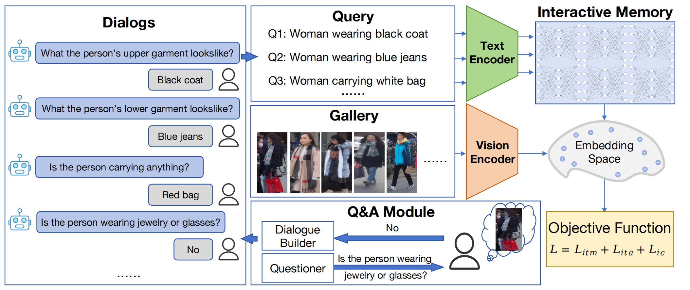
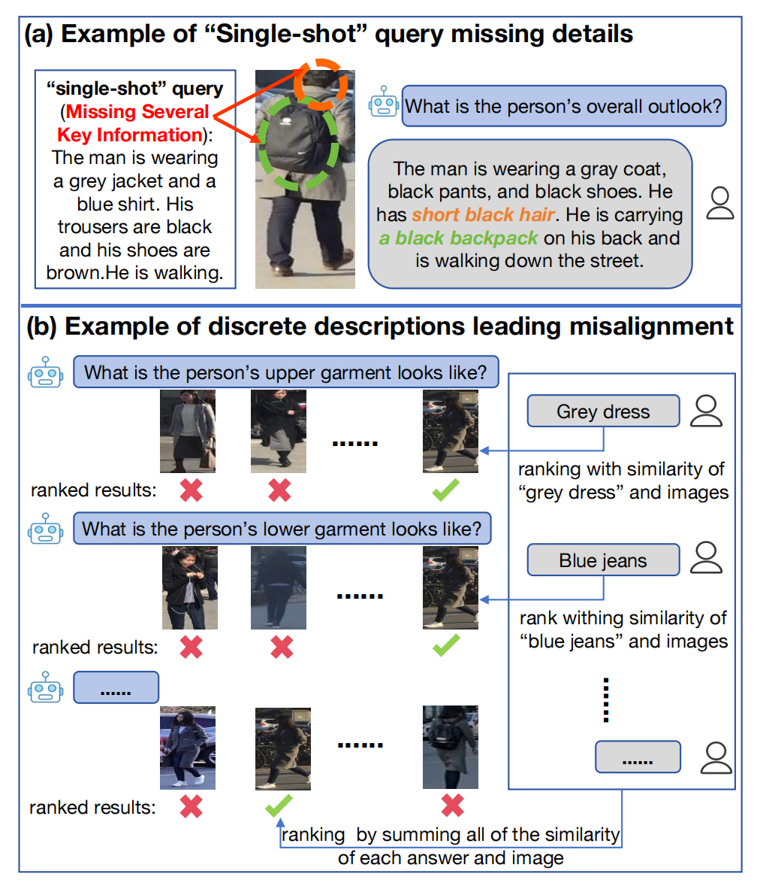
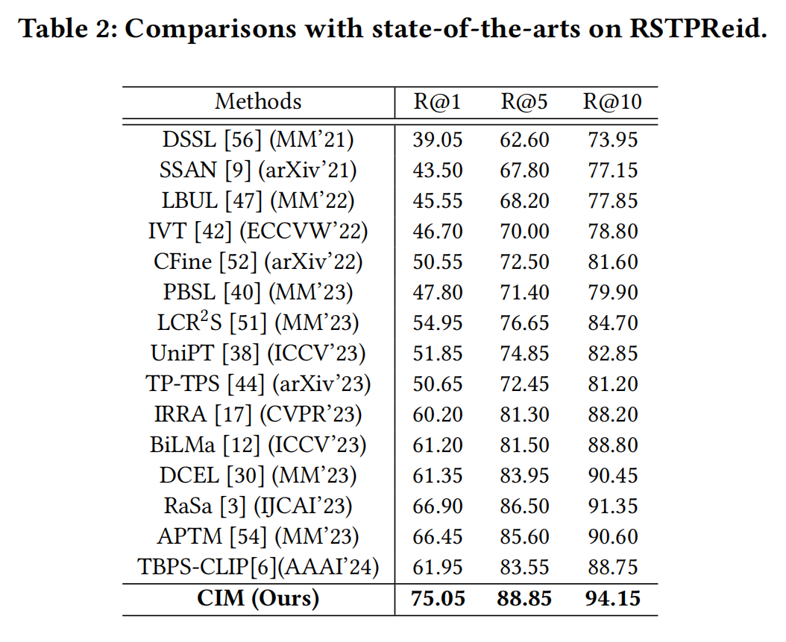
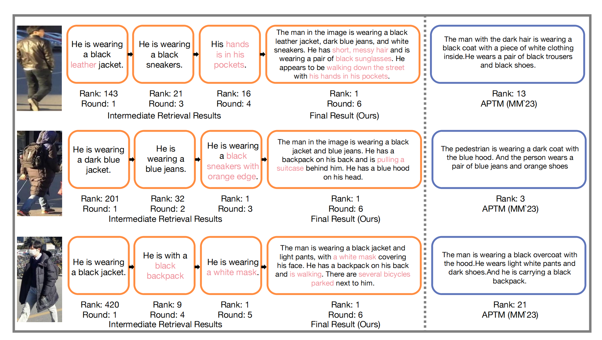

## Introduction
This is the source code of "Chatting with Interactive Memory for Text-based Person Retrieval"

## Chatting with Interactive Memory for Text-based Person Retrieval
The CIM model is structured with two integral components:
1) **Q&A Module**, A model crafted to simulate user interactions, taking into account the importance of dialogue rounds and question formulation in influencing model performance. 
2) **Interactive Retrieval Module (IRM)**, A specialized cross-modal image retrieval model designed for chat-based interactions. 



## Proposed Framework (CIM)
* Q&A Module
* Interactive Retrieval Module (IRM)


## Motivation

* Existing “single-shot" query approaches where the query misses the details of the target image. (b) ChatIR with multiple discrete descriptions that lead to improper query results.

## Results



## Retrieval Examples



## Usage
* Download the CUHK-PEDES dataset, ICFG-PEDES dataset and RSTPReid dataset.
* Training
```python
python3 run.py \
--task "itr_rstp" \
--dist "gpu0" \
--output_dir "your_output_path" \
--checkpoint "your_checkpoint_path.pth"
```
* Testing via Chatting
```python
python -m torch.distributed.run \
--nproc_per_node=1 eval_person_retrieval.py \
--output_dir "your_output_path" \
--task "re_icfg" \
--checkpoint "your_checkpoint_path.pth" 
